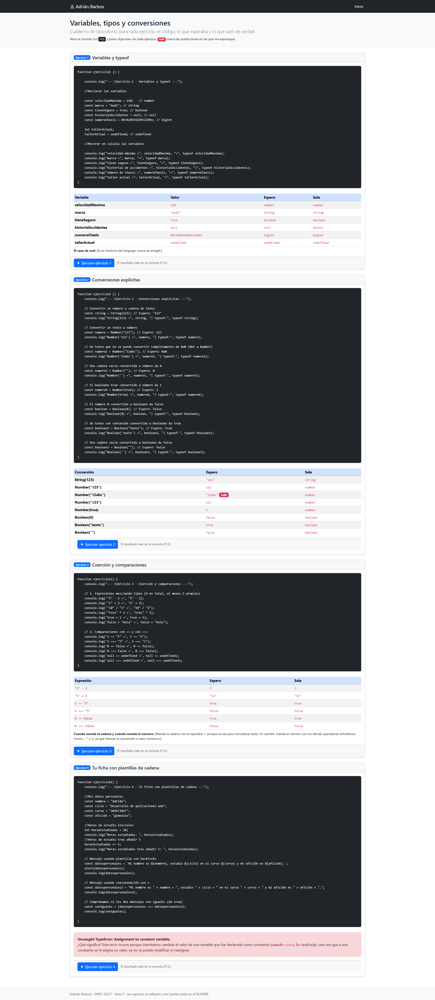
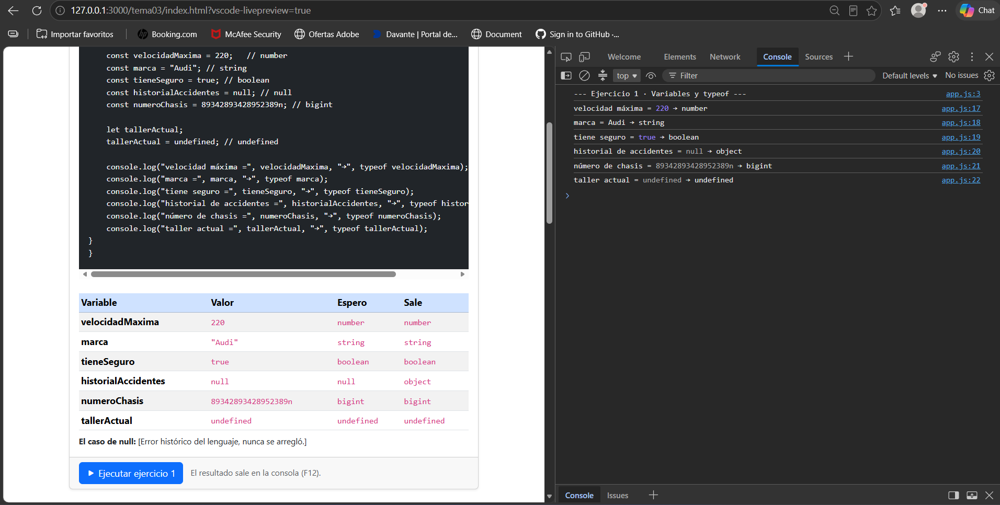
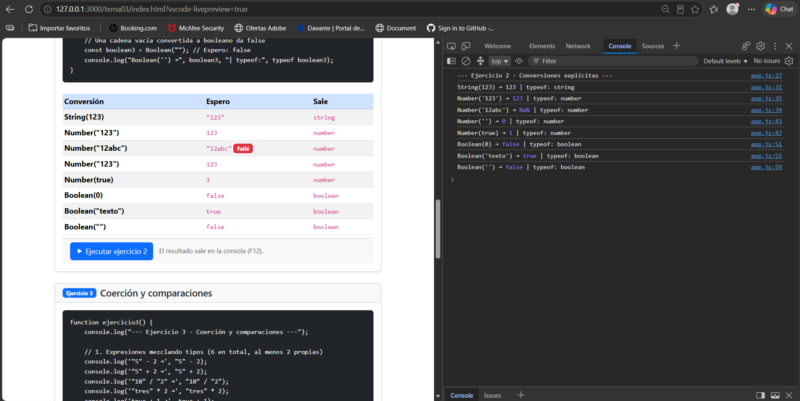
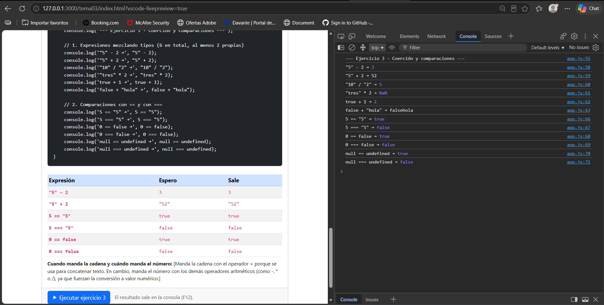
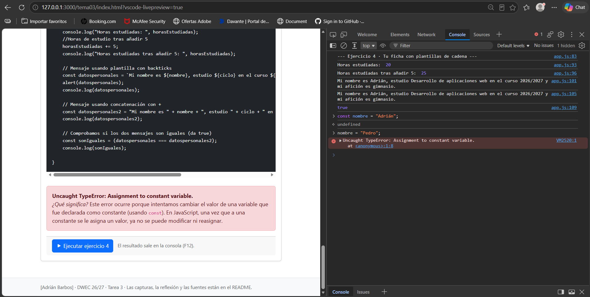

# Tarea 3 · Variables, tipos y conversiones

**Autor:** [Tu nombre y apellidos] · Desarrollo Web en Entorno Cliente (DWEC) · 2.º DAW · Curso 2026-27

> **Plantilla de la tarea 3.** Cómo usarla:
>
> 1. Copia esta carpeta en tu repositorio de DWEC y cámbiale el nombre a `tema03`.
> 2. `index.html` trae la card del ejercicio 1 como modelo: cópiala para los ejercicios 2, 3 y 4.
> 3. `js/app.js` trae una función por ejercicio: escribe tu código donde pone `TODO`.
> 4. Sustituye las imágenes de `capturas/` por las tuyas, **con el mismo nombre**.
> 5. Todo lo que va entre [corchetes] es un hueco: cámbialo por lo tuyo. Al terminar, borra este aviso.

[Una o dos líneas: qué hay en esta carpeta y cómo se ve. Por ejemplo: abrir la carpeta en VS Code, pulsar **Go Live**, abrir la consola con F12 y pulsar «Ejecutar» en cada ejercicio.]

## Capturas

### a) La página entera

[En la captura adjunta de la interfaz de usuario se pueden observar con claridad los siguientes elementos:   Navbar superior: Muestra el nombre de usuario Adrián Barcos en la esquina superior izquierda de la barra de navegación.   Estructura principal: La vista se compone de cuatro tarjetas (cards) estructuradas verticalmente, correspondientes a distintos bloques o ejercicios:   Variables y typeof   Conversiones explícitas   Coerción y comparaciones   Tu ficha con plantillas de cadena   Predicciones y errores: Dentro de las tablas asociadas a cada tarjeta se visualizan las celdas comparativas entre el valor esperado (Espero) y el valor obtenido (Sale). Los fallos de predicción quedan explícitamente resaltados con fondo o etiquetas en color rojo donde los valores no coinciden.]

### b) Consola del ejercicio 1

[En esta captura se aprecia la pantalla dividida mostrando la página web del Ejercicio 1 a la izquierda junto al botón "Ejecutar ejercicio 1", y el panel de herramientas de desarrollo (DevTools) abierto en la pestaña Console a la derecha.]

### c) Consola del ejercicio 2

[Qué se ve, en una o dos líneas.]

### d) Consola del ejercicio 3

[Qué se ve, en una o dos líneas.]

### e) Consola del ejercicio 4, con el error de la const

[Qué se ve, en una o dos líneas.]

## Reflexión

[De 5 a 8 líneas: ¿qué conversiones te resultaron más intuitivas y cuáles te sorprendieron? Pon ejemplos concretos de tus tablas.]

## Fuentes

- [Título de la página](https://enlace-a-la-fuente)

## Uso de IA

[Si has usado IA: qué herramienta, para qué y qué hiciste después con su respuesta. Si no la has usado, borra este apartado.]
